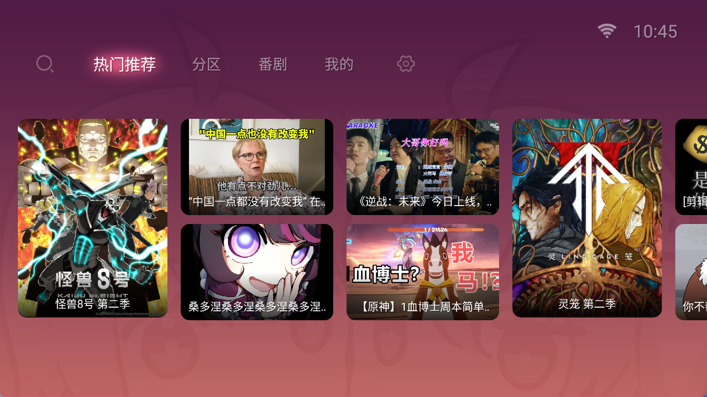
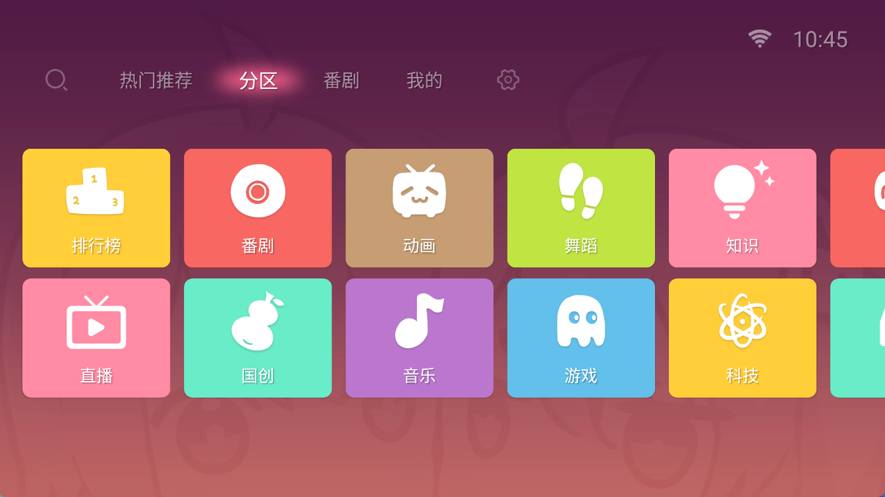
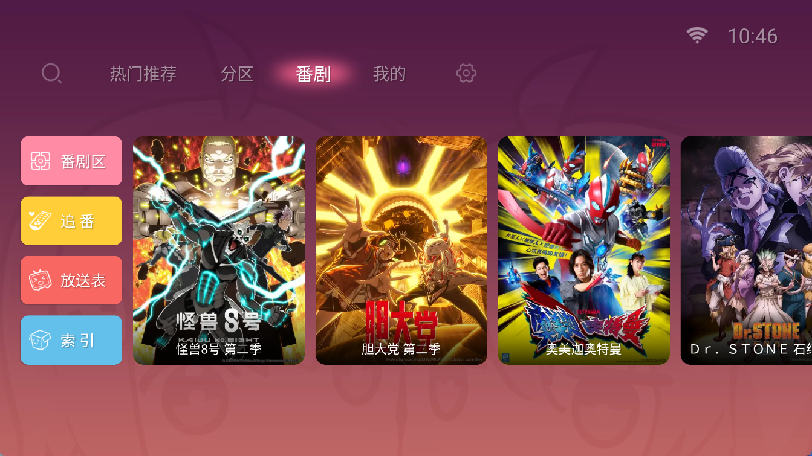
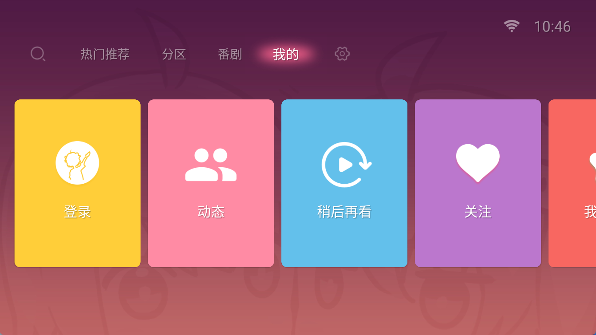
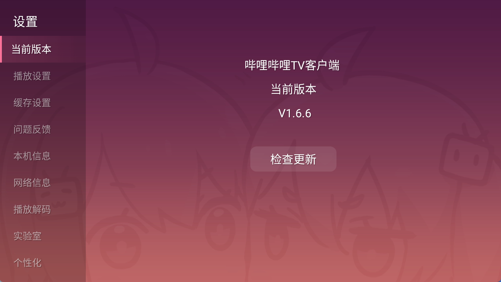

应用名称：哔哩哔哩TV版
版本：1.6.6
更新时间：2026-01-14
应用大小：7.83 MB
##应用介绍
哔哩哔哩TV版（云视听小电视）是哔哩哔哩弹幕网站的官方电视盒子客户端，提供了丰富的视频内容，包括番剧、国创、电影、电视剧、纪录片、游戏、鬼畜、时尚、舞蹈、科技、音乐等哔哩哔哩网站上的视频资源，用户可以在线观看。用户可以使用哔哩哔哩账号登录客户端，登录后可以同步账号信息、追番、收藏以及观看历史记录，解决因设备转移而导致的数据不同步问题。

##应用截图

其它版本：
哔哩哔哩_v1.6.6_v11正式版.apk
