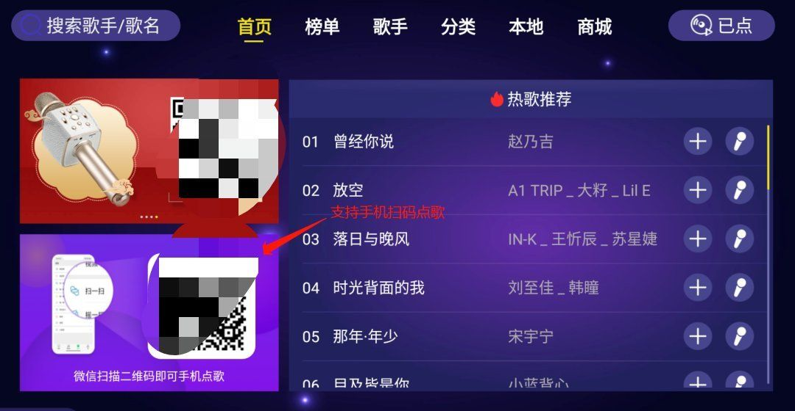

应用名称：家庭KTV
版本：1.19
更新时间：2026-01-14
应用大小：15.91 MB
##应用介绍
家庭KTV是电视端一款免费的K歌软件，只需在电视上安装，然后再配上个无线话筒，就能将客厅瞬间变成KTV包间尽情享受音乐的乐趣。相比其它网络上各种不同类型的修改版，如某狗、某民，来了又走，和谐了又来，无尽的折腾，最后发现还是家庭KTV最稳最良心。

##应用截图

其它版本：
家庭KTV_v1.15_去更新_保留手机点歌.apk
家庭KTV_v1.3.0.apk
家庭KTV_v1.1.6.apk
