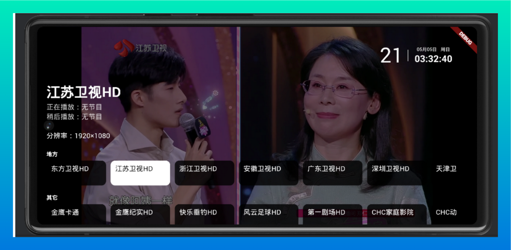
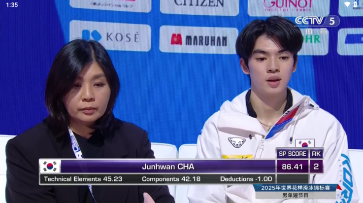

应用名称：HTV
版本：4.8.0
更新时间：2026-01-14
应用大小：20.32 MB
##应用介绍
H TV是一款全新的开源 电视直播软件，功能非常简洁，常用的频道播放都支持，会根据省一级的地区做区分，频道列表显示央视、卫视和本身的地方台。港澳台和国外、西藏、贵州等少数几个地区用的北京市的 IPTV源。自动每天更新源，不再做版本变动，保持稳定方便使用。

##应用截图

其它版本：
HTV-v3.6.0.apk
HTV-v3.5.0.apk
