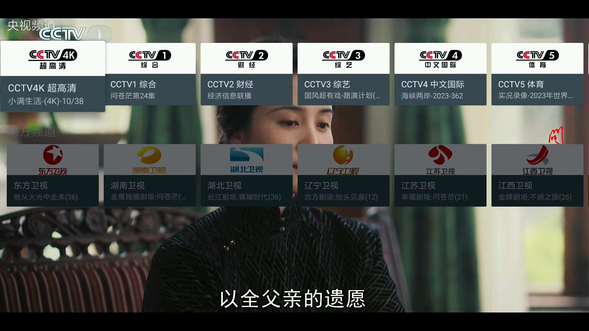

应用名称：MyTV
版本：2.2.7-all-sdk21
更新时间：2026-01-14
应用大小：4.45 MB
##应用介绍
一款开源、免费、无广告、不用注册的电视直播软件，适用于 Android 5 及以上的手机和电视盒子。它安装即用、启动快，没有花里胡哨的 UI 和弹框，内置中央台、地方台等优质直播源，画质高清、播放流畅，支持倍速播放、切换清晰度、搜索频道、频道排序等功能。

##应用截图

其它版本：
mytv-android-tv-1.3.0.172-all-sdk21-伪装版.apk
mytv-android-tv-1.3.0.172-all-sdk21-正常版.apk
mytv-android-tv-1.1.1.135-all-sdk21-伪装版.apk
mytv-android-tv-1.1.1.135-all-sdk21-正常版.apk
mytv-v0.1.3.9.8.apk
