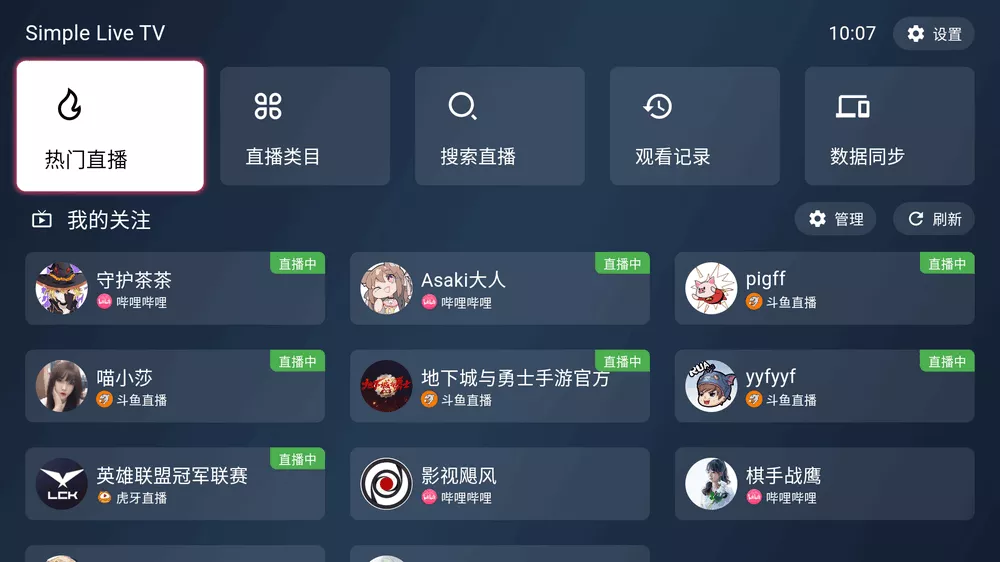
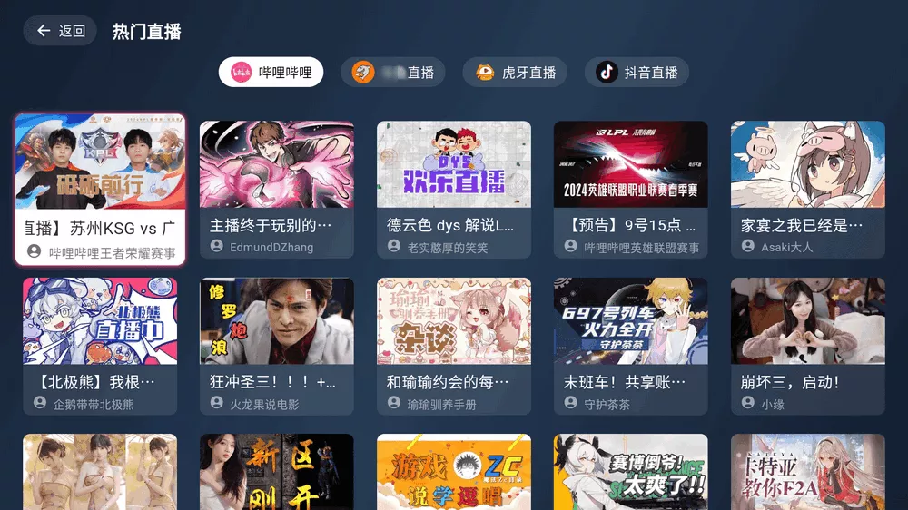
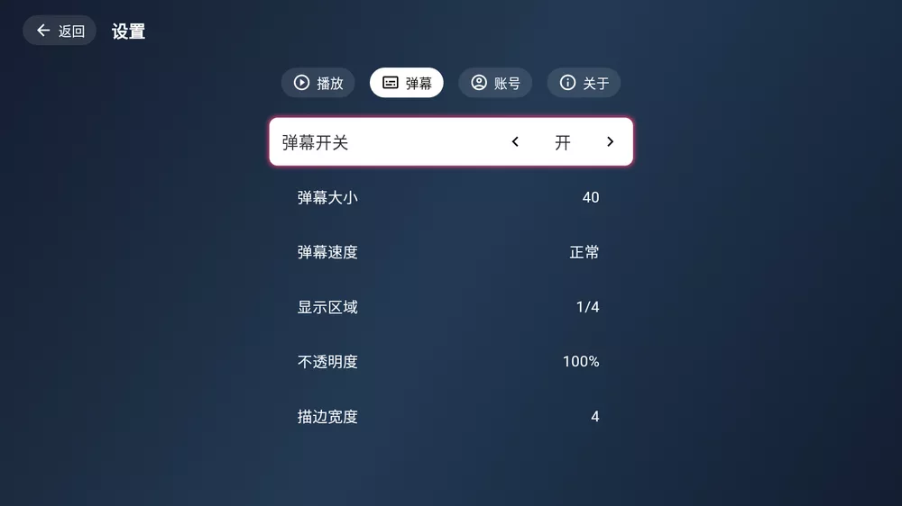
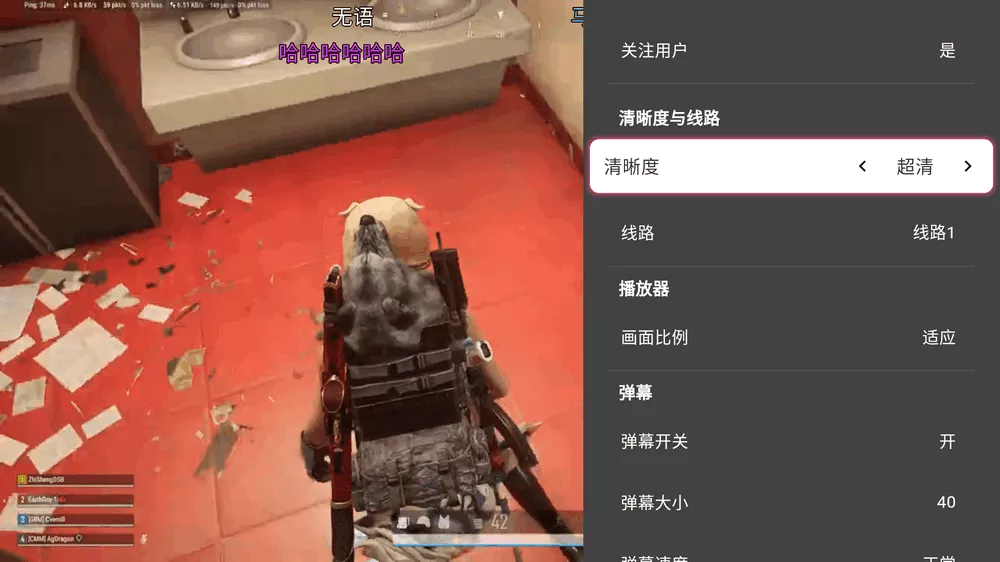

应用名称：SimpleLive
版本：1.9.8-手机版64位
更新时间：2026-01-14
应用大小：37.16 MB
##应用介绍
Simple Live 是一款基于 AllLive 项目 开发的开源聚合直播 APP，支持 哔哩哔哩、虎牙、斗鱼、抖音 等主流平台，具备 无广告、低占用、弹幕互动 等核心优势。其核心功能包括：全平台覆盖：一站式聚合多平台直播资源，无需切换多个APP；纯净体验：绿色无广告，界面简洁，专注直播内容本身；互动增强：支持实时弹幕显示、关键词屏蔽、弹幕样式自定义（如大小、速度、透明度调节）；轻量化设计：安装包小巧，运行流畅，适配安卓设备。

##应用截图

其它版本：
SimpleLive1.9.8-手机版32位.apk
SimpleLive1.5.5-TV版64位.apk
SimpleLive1.5.5-TV版32位.apk
