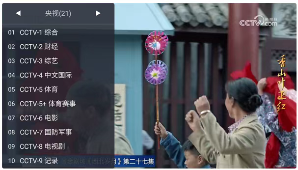
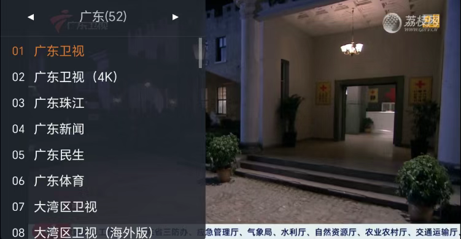
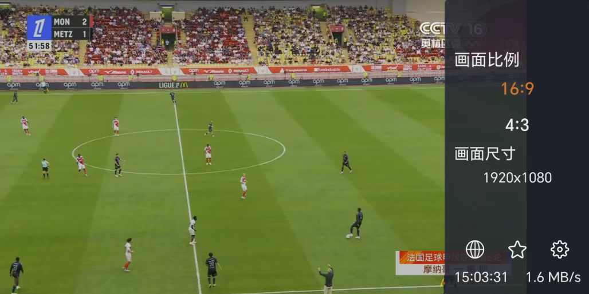
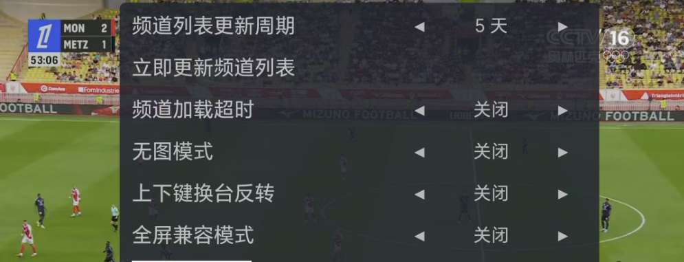

应用名称：WebViewTV
版本：2.1.0
更新时间：2026-01-14
应用大小：2.70 MB
##应用介绍
WebView 电视是一款极简的电视直播软件，专为追求轻量和高效的用户设计。该应用仅2MB大小，却能提供包括央视、卫视及地方台在内的丰富频道资源，确保永久稳定不失效。最新版本修复了荔枝网播放问题，并兼容低版本安卓系统，进一步优化了直播源的稳定性。无论是在手机还是电视上使用，都能享受简单易用、无广告干扰的流畅观看体验。

##应用截图

其它版本：
WebViewTV_2.0.4.apk
WebView+电视_1.10.12.apk
WebViewTV_1.10.10.apk
