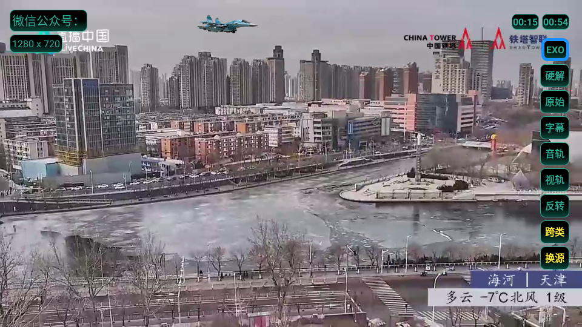
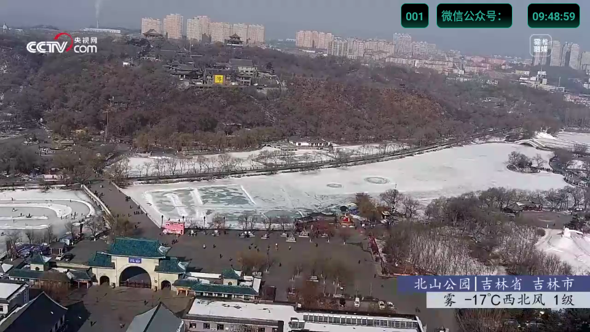
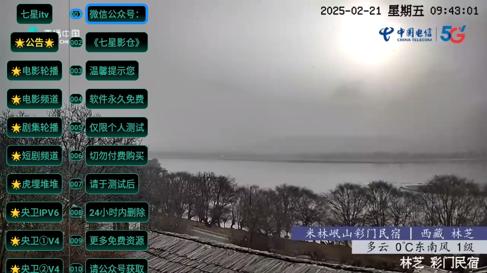

应用名称：七星电视
版本：250521
更新时间：2026-01-14
应用大小：5.21 MB
##应用介绍
七星电视是一款面向安卓电视盒子及智能电视的直播类应用，采用类似“电视家”“酷9”的主流直播壳子重构界面，操作逻辑更直观，适合家庭用户快速上手。软件内置多套高质量电视直播源，涵盖央视、各省级卫视、地方台、新闻、体育、影视轮播等频道类型，所有内容免费开放，无需登录或付费，启动即看。

##应用截图

其它版本：
七星电视_250118.apk
七星电视2.0.apk
七星电视_内置央网源.apk
