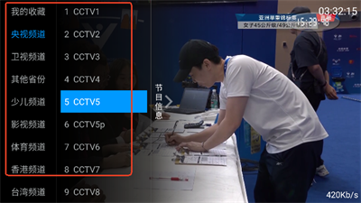
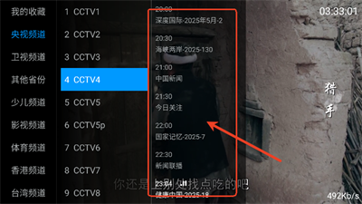
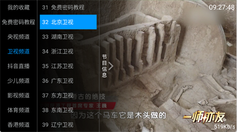
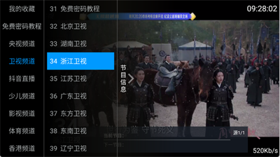

应用名称：全网通电视
版本：1.0
更新时间：2026-01-14
应用大小：19.88 MB
##应用介绍
全网通电视是一款聚合央视、卫视、地方台及特色频道的正版电视直播软件，提供超1000个高清电视频道24小时不间断播放。采用智能CDN加速技术，确保画面流畅不卡顿，支持时移回看、节目预约等功能，界面简洁易操作，是中老年及家庭用户观看电视节目的首选应用！

##应用截图

其它版本：
无
