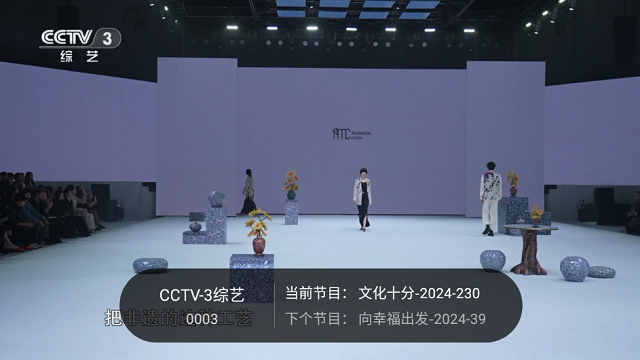
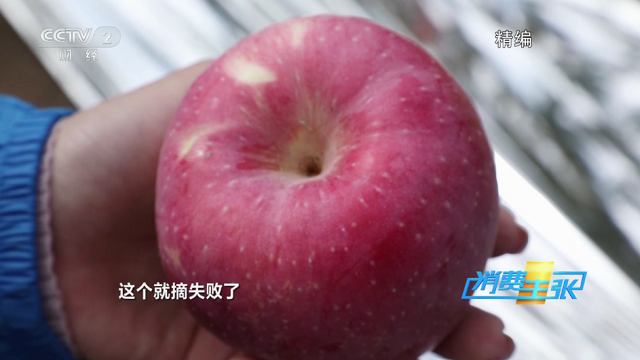
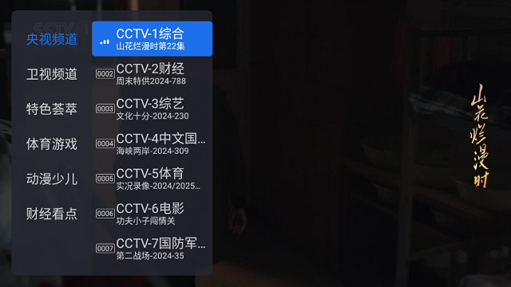

应用名称：千寻直播
版本：1.1.2
更新时间：2026-01-14
应用大小：8.01 MB
##应用介绍
千寻TV是一款专为智能电视、电视盒子、投影仪等大屏设备设计的电视直播软件。它整合了央视、各大卫视、体育频道、动漫少儿、财经专题等海量电视频道，支持高清直播、节目预约、频道收藏等功能，真正做到打开即看，无需等待。

##应用截图

其它版本：
千寻直播_1.1.0[支持语音换台].apk
