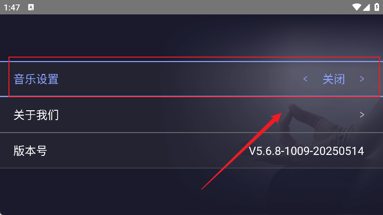

应用名称：每日瑜伽
版本：5.4.5
更新时间：2026-01-14
应用大小：20.26 MB
##应用介绍
每日瑜伽TV版是一款专为智能电视用户打造的家庭瑜伽训练软件，致力于帮助用户在家中舒适、科学地进行瑜伽练习。平台提供丰富的动态瑜伽课程，覆盖初学入门、塑形减脂、核心训练、舒缓放松等多个方向，课程由专业导师编排，语音引导清晰，配合柔和音乐营造沉浸式练习氛围。与手机App相比，TV版本以更大屏幕呈现动作细节，利于模仿学习，尤其适合追求画面清晰度和练习姿势标准化的用户。它不仅打破了“必须去瑜伽馆”的时间与空间限制，还通过打卡记录、个性推荐、社群互动等功能，激发用户持之以恒的动力。

##应用截图

其它版本：
无
