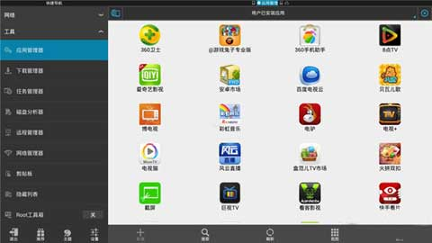
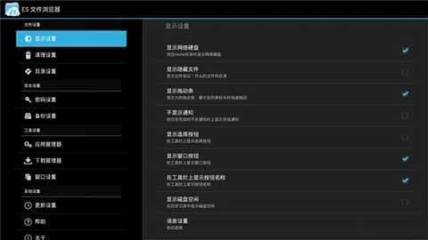
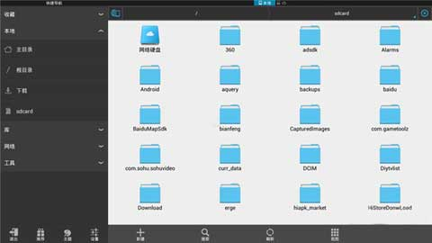
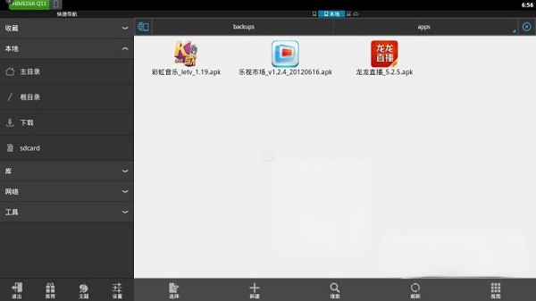
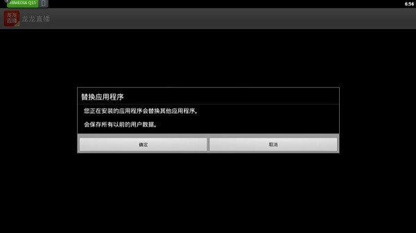

应用名称：ES文件浏览器
版本：4.4.3.7
更新时间：2026-01-14
应用大小：59.85 MB
##应用介绍
ES文件浏览器是支持本地和网络文件管理的强大软件，软件所具备的文件管理，应用管理、压缩/解压、文本编辑、局域网/FTP远程连接和视频便捷等功能，同时基于产品力的强大功能，不少电视盒子也开始使用，为此这里小编要为你推荐的便是es文件浏览器tv版，并当前用户在手机上能够体验到的所有功能，在这里同样适用，如在文件管理方式上，多种视图列表和排序方式的选择，可以快速帮助用户查看并打开各类文件，期间你还通过本地SD卡、局域网、OTG设备之间任意传输文件，其他的操作选项还支持多选、复制、粘贴、查看属性、解压、重命名和置顶。

##应用截图

其它版本：
ES文件浏览器4.4.3.6会员版-derrin.apk
ES文件浏览器-4.4.3.2--IP-All-Balatan.apk
ES文件浏览器-4.4.3.1--IP-All-Balatan.apk
