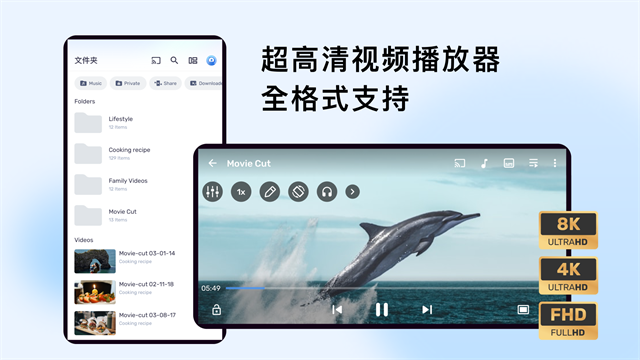

应用名称：MX播放器
版本：1.94.0-v8a-CN-Mod
更新时间：2026-01-14
应用大小：42.89 MB
##应用介绍
MX Player pro播放器最新版是一款非常强悍的安卓手机超高清视频播放神器，该软件以超强的解码性能以及兼容性闻名，对字幕的支持更是堪称一绝，能够兼容特效字幕，支持在线字幕匹配，看外语片无需自己找字幕！还支持3GP、AVI DIVX、F4V、FLV、MKV、MP4、MPEG、MOV、VOB、WMV、WEBM、XviD等格式的输出。

##应用截图

其它版本：
MXPlayer-Pro-1.86.0-v7a-Mod-Balatan.apk
MX_Player_1.78.6.apk
