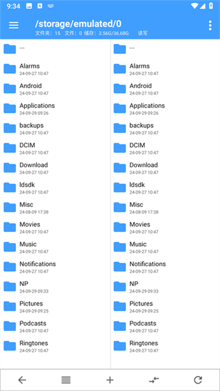
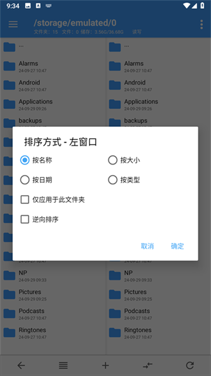
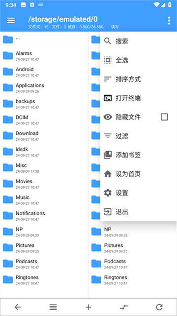
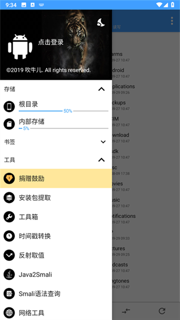

应用名称：NP管理器
版本：3.1.21
更新时间：2026-01-14
应用大小：43.05 MB
##应用介绍
NP管理器堪称安卓端功能全面的带有反编译功能的文件管理神器，其与安卓搞机界知名的mt管理器在功能和使用方面差不多，其在搭配Shizuku使用时，能够解锁其强大潜力，为安卓搞机爱好者与开发者带来极致体验。它不仅具备基础的复制、重命名、粘贴等文件操作功能，更在APK文件编辑领域表现卓越，支持一键添加/移除弹窗、Xposed 检测模块植入、包名更换、axml反编译等逆向操作，无需深奥代码知识，即可轻松修改应用或游戏，满足个性化定制需求。

##应用截图

其它版本：
NP管理器-3.1.19.apk
