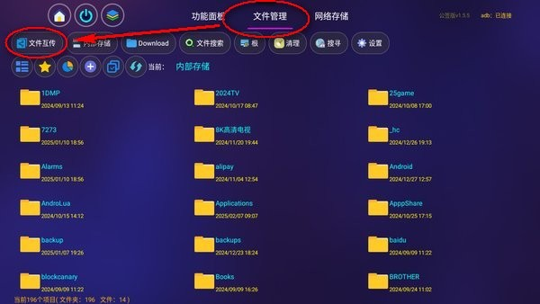
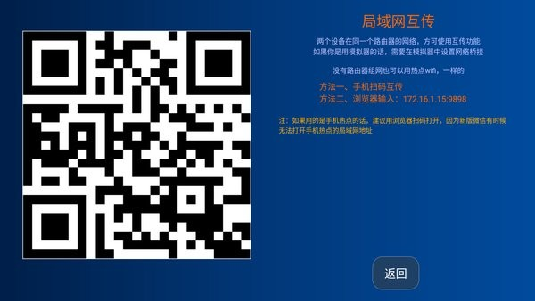
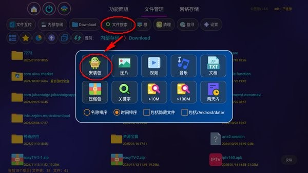
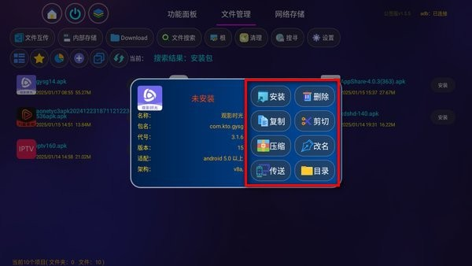

应用名称：应用管家
版本：1.8.8-公签版
更新时间：2026-01-14
应用大小：18.42 MB
##应用介绍
应用管家是专为安卓系统打造的应用和文件管理软件，它可以获取到电视中的所有应用程序和文件数据，方便用户进行删除、移动等；如果连接手机后，还可以将手机中的应用传输到电视上进行安装，这样就不需要U盘了。

##应用截图

其它版本：
应用管家v1.8.8-普通版.apk
应用管家v1.8.8-海信版.apk
应用管家v1.8.2-公签版.apk
应用管家v1.8.2-普通版.apk
应用管家v1.5.6(1560)-公签版.apk
应用管家v1.5.6(1560).apk
