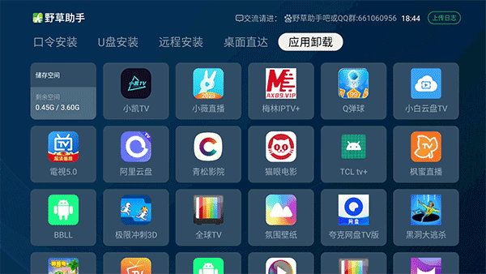
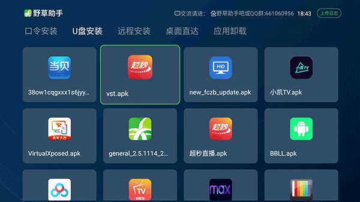
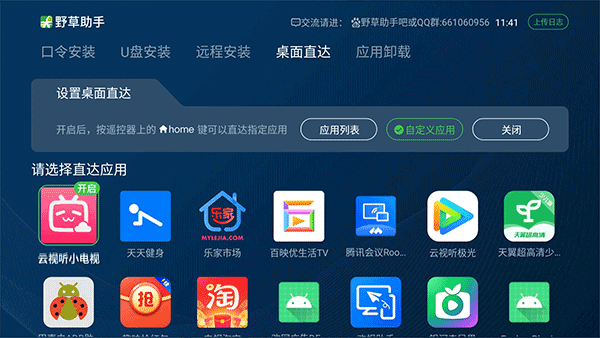

应用名称：野草助手
版本：2.0.12
更新时间：2026-01-14
应用大小：15.52 MB
##应用介绍
野草助手tv版是一款专为智能电视打造的应用市场软件，其特色功能包括口令安装、U盘安装及远程安装，用户无需复杂操作即可快速扩展电视功能。它支持小米、海信、创维等主流电视品牌，通过简洁直观的界面设计，让用户轻松搜索并安装影视、游戏、教育等领域的近千款专属应用。

##应用截图

其它版本：
野草助手_2.0.12_TV版_安卓14以上.apk
野草助手_2.0.12_小米_海信TV版.apk
野草助手_v2.0.8_TV版.apk
野草助手_v2.0.7_TV版.apk
