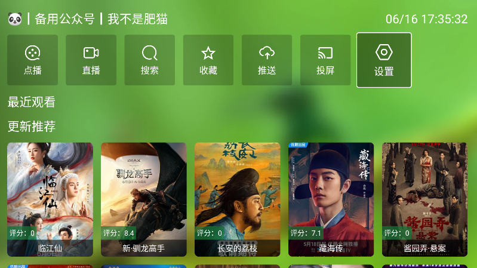
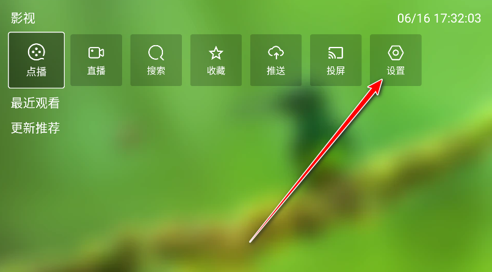
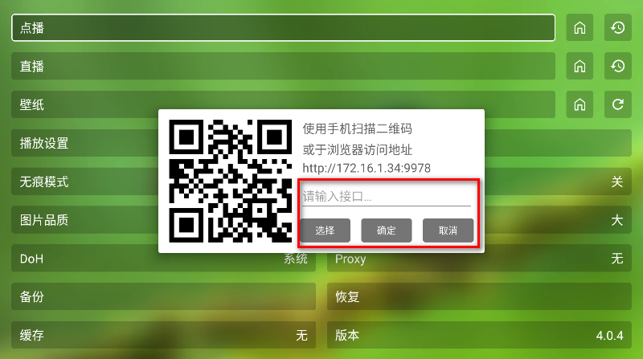

应用名称：FongMi影视
版本：5.1.1
更新时间：2026-01-14
应用大小：46.23 MB
##应用介绍
FongMi影视也叫蜂蜜影视。是一款基于猫影视开源项目开发的电视tv盒子。在使用之前，需要我们配置相关的接口地址。里面啥都有，电影、电视剧、综艺、动漫，你想看啥，它就给你变出啥，而且更新速度那叫一个快，好多院线大片都能在里面找到。追剧看片再也不愁，躺着坐着，想怎么看就怎么看！

##应用截图

其它版本：
FM影视TV端-64位_v5.1.1_正式版.apk
FM影视手机端-32位_v5.1.1_正式版.apk
FM影视手机端-64位_v5.1.1_正式版.apk
FM影视TV端-32位_v4.9.9_内植共存版.apk
FM影视TV端-64位_v4.9.9_内植共存版.apk
FM影视手机端-32位_v4.9.9_内植共存版.apk
FM影视手机端-64位_v4.9.9_内植共存版.apk
FM影视TV端-32位_v3.9.7_正式版.apk
FM影视TV端-64位_v3.9.7_正式版.apk
FM影视手机端-32位_v3.9.7_正式版.apk
FM影视手机端-64位_v3.9.7_正式版.apk
FM影视TV端-32位_v3.9.4_内置共存版.apk
FM影视TV端-64位_v3.9.4_内置共存版.apk
FM影视手机端-32位_v3.9.4_内置共存版.apk
FM影视手机端-64位_v3.9.4_内置共存版.apk
