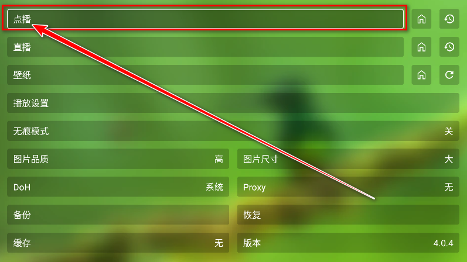

应用名称：OK影视
版本：3.9.1
更新时间：2026-01-14
应用大小：83.64 MB
##应用介绍
OK影视是一款非常好用的视频播放软件，用户可以自由配置接口，操作简单易上手，无论是热播电影、剧集还是综艺，都能免费随心观看，满足你的多样化娱乐需求。软件还支持用户通过关键词搜索想看的剧集，轻松找到心仪的内容。此外，OK影视还提供了多种个性设置，比如播放速度调节、长按倍速播放以及无痕模式等，全方位打造舒适、便捷的观影体验。

##应用截图

其它版本：
OK影视Pro-电视版-32位-3.9.1.apk
OK影视Pro-电视版-64位-3.9.1.apk
OK影视-手机版-3.6.0.apk
OK影视-电视版-3.6.0.apk
OK影视TV端-32位_v3.6.0_内置共存版.apk
OK影视TV端-64位_v3.6.0_内置共存版.apk
OK影视手机端-32位_v3.6.0_内置共存版.apk
OK影视手机端-64位_v3.6.0_内置共存版.apk
海信专版-OK影视-3.6.0.apk
