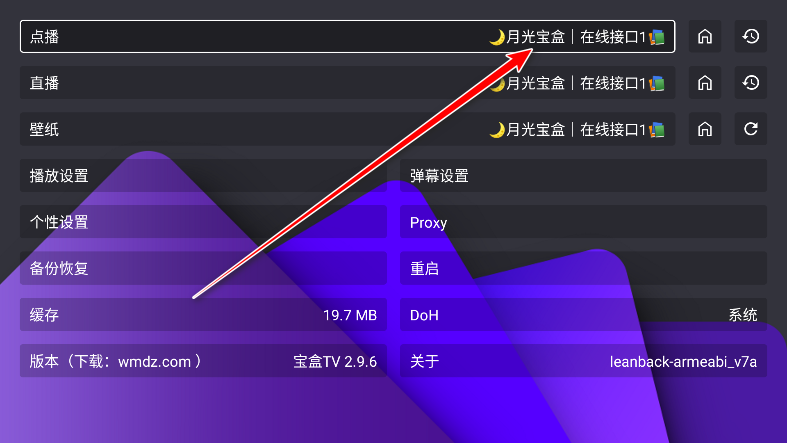
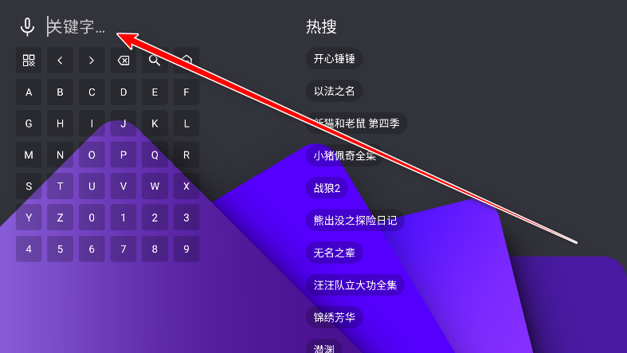
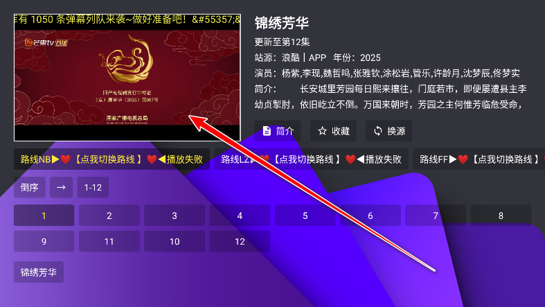

应用名称：宝盒TV
版本：4.1.3
更新时间：2026-01-14
应用大小：59.21 MB
##应用介绍
宝盒TV电视盒子是一款非常实用的影视直播软件，能够将普通电视变成智能电视，支持观看电影、电视剧、动漫等丰富的视频内容，全部免费观看。只需下载安装，不需要繁琐的注册和登录流程，用户就能轻松享受各种影视资源。无论是想追剧还是看综艺，宝盒TV都能满足你的需求。

##应用截图

其它版本：
宝盒手机4.1.3(FM内置版).apk
宝盒TV3.5.7.apk
宝盒手机3.5.7.apk
宝盒TV2.9.3.apk
宝盒手机2.9.3.apk
